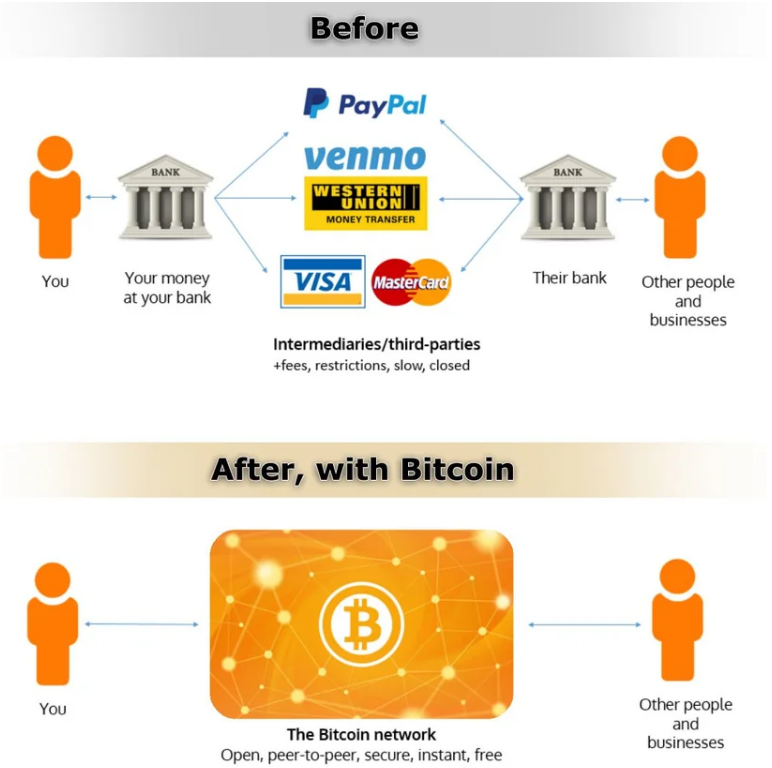
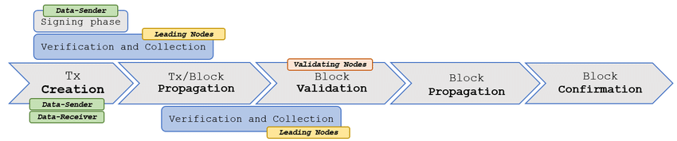
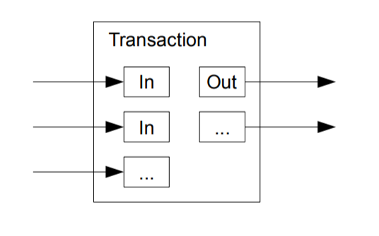
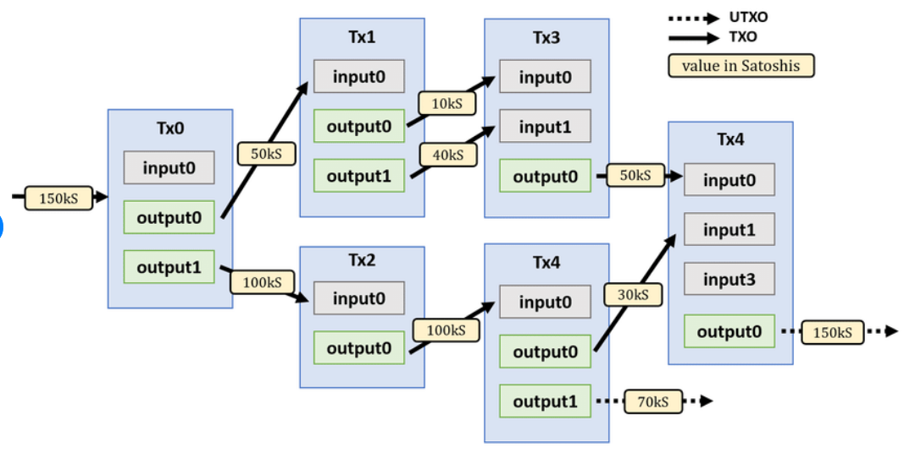
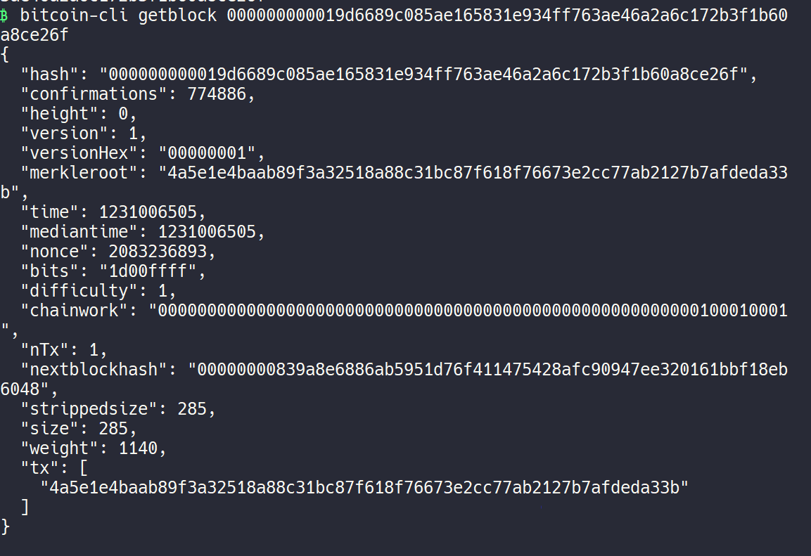
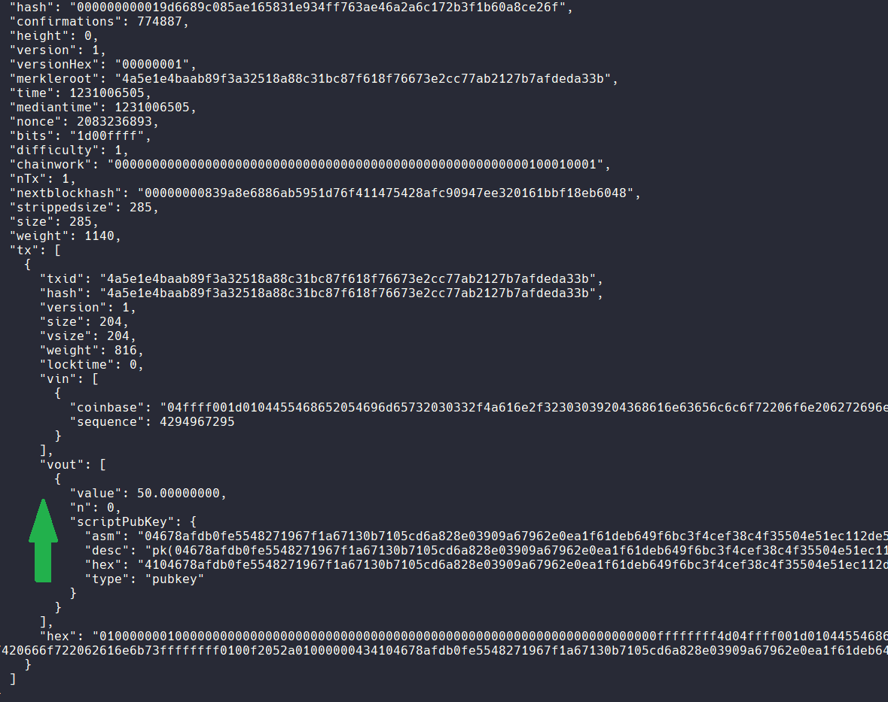
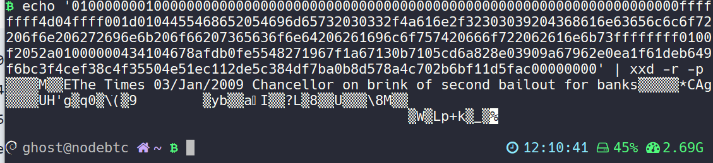

# Análisis Onchain


[](https://raw.githubusercontent.com/drkostas/Youtube-FirstCommentBot/master/LICENSE)

---
## Tabla de Contenido

+ [Introducción](#intro)
+ [Instalando](#instalando)
    + [Prerequisitos](#req)
+ [Transacciones en Bitcoin](#tx)
+ [Scripts en python](#py)
  + [hello world](#helloworld)
  + [Tamaño de Bloque](#size)

---
## Introducción  <a name = "intro"></a>

Con un nodo completo de Bitcoin que tenga completada la sinctronización se tiene una copia completa (y auto verificada) del blockchain, desde el primer bloque hasta el último nuevo que se genere. 

Este se configuró (ver [Bitcoin.conf](https://github.com/CobraPython/BitcoinResearch/blob/main/Apuntes/Manuales/Bitcoin.conf.pdf)) de tal forma que admite solicitudes RPC-Json desde otros ordenadores de la red interna para luego procesar data.

## Instalando  <a name = "instalando"></a>

Ya corriendo el nodo y esperando solicitudes, se debe tener en cuenta a las credenciales de acceso que se configuraron en el `bitcoin.conf`. Se deben disponer de `user y password` para acceder al RPC de Bitcoin Core, para no dejarlos explicitamente los declaramos en como variables de entorno `.env`.

Se hace uso de dos librerías para acceder a bitcoin-core usando python:

  1. python-bitcoinlib
  2. python-bitcoinrpc

Los scripts [helloworld1.py](https://github.com/CobraPython/BitcoinResearch/blob/main/Onchain/helloworld1.py) y [helloworld1.py](https://github.com/CobraPython/BitcoinResearch/blob/main/Onchain/helloworld2.py) son un ejemplo para probar la conexión y funcionamiento de cada librería respectivamente.

### Pre requisitos  <a name = "req"></a>

Se crea un entorno de trabajo para Python `python3 venv -m rpibots` y se activa el entorno con `cd rpibots && source bin/python`. (Se pueden usar otros gestores de entornos virtuales como virtualenv o conda, en nuestro caso se usa venv).

``` sh
git clone https://github.com/CobraPython/BitcoinResearch
cd BitcoinResearch/Onchain
pip install -r req.txt
```
Si todo esta correctamente, al ejecutar cualquier script obtenemos el resultado de ejecutar `bitcoin-cli getblockchaininfo`.


## Transacciones en Bitcoin  <a name = "tx"></a>

Las transacciones son la parte más importante del sistema bitcoin. Todo lo demás en bitcoin fue
diseñado para asegurar que las transacciones puedan ser creadas, propagadas por la red, validadas y
finalmente añadidas al libro contable global (la cadena de bloques). 

Las transacciones son estructuras
de datos que codifican la transferencia de valor entre los participantes en el sistema bitcoin. Cada
transacción es una entrada pública en la cadena de bloques de bitcoin, el libro contable global de
contabilidad por partida doble.

Bitcoin tiene unas características como (crypto) moneda:

  - Cada bloque debe ser generado con las transacciones que se solicitan, en competencia. Las transacciones no pueden ser censuradas. 
  - Una transacción que es confirmada por un bloque es virtualmente irreversible (a partir de 2 a 6 bloques encima se considera como tal).
  - Tiene una politica de emisión restringida a menos de 21 millones de bitcoins.
  - Cada bitcoin tiene su historial desde su creación (al generar bloques con minería) hasta el último poseedor, todos los movimientos son transparentes para todos en la red. 

Estas características la convierten en una moneda muy segura en comparación a otras. No se pueden falsificar ni generar de otra forma. El transferir valor a través de Bitcoin es lo más parecido a pagar en efectivo, en persona. Una vez solicitada una transacción a la red esta se ejecutará directamente a la otra persona.  




### Ciclo de Vida de una Transacción





1. Creación de la transacción (generación). Para crear una transacción se deben ordenar en formato de entradas/salidas.

2. Firma. Para autorizar el gasto se debe presentar las firmas de propiedad.

3. Transimisión de la transacción a la red (propagación). Cada nodo de la red (participante) valida y propaga la transacción hasta que alcanza a
(casi) todos los nodos en la red


4. Finalmente la transacción es verificada por un nodo minero e incluida en un bloque de transacciones que es registrado en la cadena de bloques.

5. Este bloque se propaga a toda la red, siendo validada por cada  nodo en la red. 

La información de una transacción no es sensible pues no lleva la clave privada sino únicamente la firma. El peso promedio de una transacción esta entre los 300 y 400 bytes de datos.
Una transacción bitcoin puede ser enviada sobre cualquier red. Siempre y cuando la transacción pueda
alcanzar un nodo de la red bitcoin que la propague, no importa cómo es transportada al primer nodo.

### Estructura de una Transacción

Una transacción es una estructura de datos que codifica una transferencia de valor de una fuente de
fondos, llamada entrada (input), a un destinatario, llamado una salida (output). Las entradas y salidas
de una transacción no se encuentran relacionadas a cuentas ni identidades. En cambio debes pensar
en ellas como montos de bitcoin—trozos de bitcoin—asegurados con un secreto específico que solo su dueño, o persona que conoce el secreto, puede liberar.

#### Entradas y Salidas

La pieza fundamental de una transacción bitcoin es una salida de **transacción no gastada (unspent
transaction output), o UTXO**.

El modelo de una transacción se puede ver en el siguiente esquema.



Una transacción cuenta de entradas y salidas. Las entradas son los ingresos de dinero y las salidas los gastos que se efectúan. Los bitcoins estan en **la salida** de cada transacción.

Es bastante parecido al manejo de efectivo. Las salidas no gastadas no pueden dividirse. Es como pagar una cuenta de 5 dolares con un billete de 10. No se puede fraccionar el billete en pedazos, por lo que el cambio será otro billete de 5. 

Los bitcoins no se almacenan en una cuenta o una se agrupan por etiqueta. Los bitcoins son las salidas UTXO y están distribuidas en desorden en los bloques. Cada nuevo gasto viene de una entrada anterior, y esta a su vez viene de otra entrada y así hasta un punto inicial: Los bitcoin nacen cuando se genera un nuevo bloque.





Cada salida tiene asociada una dirección (wallet) que tendra el control de los bitcoins. Las transacciones son conjuntos de datos que no contienen información sensible. Una analogía es el cheque. Estos se pueden escribir pero no tienen validez hasta que alguien propietario estampa su firma. 

De igual forma, las transacciones en bitcoin no tienen información sensible. La firma se verifica por el sistema usando funciones criptográficas (Curva Elíptica). Solo quien es dueño de la llave privada puede firmar correctamente la transacción. 

Un nodo bitcoin core tiene en su base de datos la información únicamente de las UTXO, transacciones no gastadas. Un bloque pesa en promedio 1 MB (y se limita a 4 MB con Segwit). Las transacciones tienen un costo de comisión que no depende del monto a transferir (como lo hace WesterUnion) sino de cuanto pesa (bytes) la transacción. Una transacción de muchas entradas y salidas será mas costosa que una simple entrada simple salida. El fee se ajusta por cada byte que tenga la transacción (una transacción simple llega a los ~220 bytes) y los mineros toman con mas prioridad a los que dejan un fee mayor.

Una vez que un minero encuentra un bloque que cumpla la prueba de trabajo y sea válido este se propaga en toda la red. Cada nodo recibe el bloque y verifica que este correcto, luego lo sigue propagando. 
## Scripts en Python  <a name = "py"></a>

Una vez que se sabe como se conforma la estructura de datos en el blockchain de Bitcoin a través de los UTXO, vamos a usar Python para obtener información y procesarla.

### Hello World (Intro) <a name = "helloworld"></a>

#### Bitcoin-cli 

Mediante los comandos bitcoin-cli accedemos a información solicitandola directamente a Bitcoin Core en el nodo.

Como vimos los bloques guardan información de las transacciones. En promedio toma 10 minutos producir un nuevo bloque. Podemos acceder a la información de un bloque con el siguiente procedimiento:
  1. `bitcoin-cli getblockhash 0` entrega la firma del bloque solicitado, en el caso el bloque génesis (bloque 0). El resultado es `000000000019d6689c085ae165831e934ff763ae46a2a6c172b3f1b60a8ce26f` y con este hash podemos solicitar información completa.
  2. `bitcoin-cli getblock 000000000019d6689c085ae165831e934ff763ae46a2a6c172b3f1b60a8ce26f` Con este comando accedemos al bloque por su hash.



  3. Se puede ver que el bloque tiene una única transacción identificada con un hash `4a5e1e4baab89f3a32518a88c31bc87f618f76673e2cc77ab2127b7afdeda33b` 

  4. El comando `bitcoin-cli getrawtransaction 4a5e1e4baab89f3a32518a88c31bc87f618f76673e2cc77ab2127b7afdeda33b` nos devuelve un código de error. Pues esta transacción es especial. Para acceder usamos el mismo comando de punto «2» con un argumento '2'  `bitcoin-cli getblock 000000000019d6689c085ae165831e934ff763ae46a2a6c172b3f1b60a8ce26f 2`, para entregar más información.



  En la sección 'vout' se pueden ver los 50 BTC y su pago en la dirección: `1A1zP1eP5QGefi2DMPTfTL5SLmv7DivfNa` 

  5. El comando `getrawtransaction` para otros bloques nos da una respuesta válida en HEX. Con el comando `decoderawtransaction` y el HEX se obtiene toda la información de la transacción. 

Resumiendo, cada bloque contiene una cantidad variable de transacciones identificadas con un 'tx_id'. Las transacciones contienen adentro las entradas 'vin' y las salidas 'vout'. 
En las entradas si repetimos el comando `getrawtransaction` con la salida de 'tx'


##### El mensaje secreto de Satoshi:

Si convertimos el mensaje de HEX a ASCII encontramos el mensaje secreto de satoshi:

```sh
echo "01000000010000000000000000000000000000000000000000000000000000000000000000ffffffff
4d04ffff001d0104455468652054696d65732030332f4a616e2f32303039204368616e63656c6c6f72206f6e20
6272696e6b206f66207365636f6e64206261696c6f757420666f722062616e6b73ffffffff0100f2052a010000
00434104678afdb0fe5548271967f1a67130b7105cd6a828e03909a67962e0ea1f61deb649f6bc3f4cef38c4f3
5504e51ec112de5c384df7ba0b8d578a4c702b6bf11d5fac00000000" | xxd -r -p
```


 >“The Times 03/Jan/2009 Chancellor on brink of second bailout for banks"

### Tamaño de Bloque <a name = "size"></a>

Para hacer un primer análisis encontraremos el número de bloque y el tamaño de memoria que ocupa en el blockchain.

El número de bloques ronda los 770 mil y el tamaño que se espera en promedio es de 1 MB aunque puede aceptar bloques hasta de 4 MB. 

Luego se grafica la relación número vs tamaño para ver como cambió el uso de memoria a lo largo del tiempo. 


conmutatividad:

$$A+B = B+A $$

$$A*B = B*A$$

