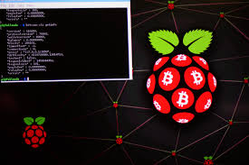

# Python y Bitcoin-cli





Después de seguir la nota :pencil: [Nodo Bitcoin](https://github.com/CobraPython/BitcoinResearch/blob/main/Apuntes/Nodo%20Bitcoin.pdf) se tiene un Bitcoin-Core configurado y sincronizando el Blockchain.

Se puede ver el estado del core de Bitcoin de varias formas:

Consultando el estatus del demon:

``` sh
sudo systemctl status bitcoind.service
``` 

Nos da una salida por el estilo.


Usando comandos del Bitcoin-Cli:

``` sh
bitcoin-cli getblockchaininfo
```

Nos devuelve un json


Utilizando los comandos bitcoin-cli se puede extraer directamente la información del Blockchain como transacciones, bloques, hash, montos, fees, wallets, movimientos, etc. 

Es de interes en el proyecto BitcoinResearch el usar scripts de python para realizar consultas a bitcoin-cli en el nodo. Pero como se detalló en la nota :pencil: [Infraestructura para Bitcoin](https://github.com/CobraPython/BitcoinResearch/blob/main/Apuntes/Infraestructura%20para%20Bitcoin..pdf) se quiere tener otro Rpi desde otros punto que este dedicado para realizar análisis de datos y exclusivamente el Rpi del nodo para extraerlos.

Para lograrlo explicamos un poco el procedimiento que seguimos:

1. Bitcoin-Core tiene un gestionador para solicitar y entregar información, el RPC (remote procedure call) 
