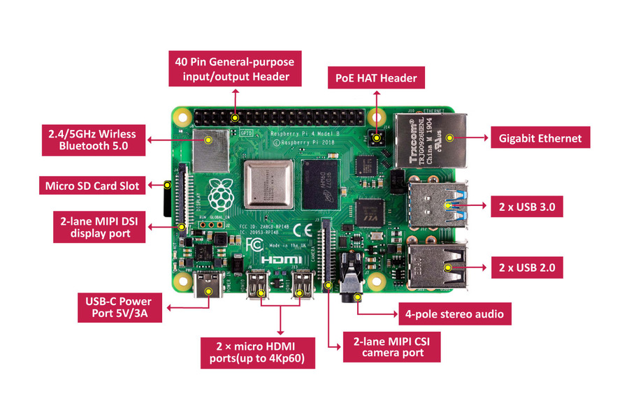

# ¡BIENVENIDO!

El proyecto *BitcoinResearch* es un estudio sobre Bitcoin en español.

Se busca mostrar como se implementa un nodo completo en Bitcoin y como se desarrollan herramientas para explotar la información del Blockchain en tiempo real para brindar, por ejemplo, estadísticas y análisis on-chain. 

El repositorio tiene el siguiente subdirectorio:

|__ :open_file_folder: Apuntes/ - Contiene notas en pdf

|__ :open_file_folder: Bibliografía/ - Libros y papers base

|__ :open_file_folder: Python-Scripts/ - Distintos scripts en python para recopilar, analizar y compilar data.

|__ :open_file_folder: Telegram-Bot/ - Un bot para comunicarse mediante Telegram.

|__ :open_file_folder: Twitter-Bot/ - Un bot para comunicarse por Twitter. 

|__  :open_file_folder: Blockchain-py/ - Un proyecto para montar un Blockchain Bitcoin propio en python. 

|__  :open_file_folder: Python-Scripts/ - Distintos scripts para usar Bitcoin-cli desde python.

## Hardware-Software

### Hardware

En el apunte :pencil: [Infraestructura para Bitcoin](https://github.com/CobraPython/BitcoinResearch/blob/main/Apuntes/Infraestructura%20para%20Bitcoin..pdf) se amplían las razones para montar un Nodo completo en Bitcoin así como también la lista completa de componentes y costos de energía que consideramos óptima para montar todo el proyecto en sus distintas etapas futuras.

Siendo la base del proyecto un micro ordenador, el Raspberry Pi4 con 4 Gb de RAM y un disco duro externo. 

En el apunte :pencil: [Nodo Bitcoin](https://github.com/CobraPython/BitcoinResearch/blob/main/Apuntes/Nodo%20Bitcoin.pdf) se explica paso a paso como instalar un Nodo desde cero. Puedes ver esta guía si te interesa montar un nodo de manera "díficil". Si quieres algo más rápido puedes usar un cliente como [Umbrel](https://umbrel.com/), [Mynode](https://mynodebtc.com/) o [Raspliblits](https://raspiblitz.org/) entre otros, que tienen soporte para un Raspberry pi4. 

Para elaborar este apunde **nos basamos en la guía** de [Raspibolt](https://raspibolt.org/) que esta en inglés. 

### Software

El nodo tendrá el desarrollo de tres proyectos en paralelo. 

   #### 1. Bot en Telegram. 
   
   En la nota :pencil: [Telegram-Bot](https://github.com/CobraPython/BitcoinResearch/tree/main/Telegram-Bot) se explican los objetivos para montar un bot de Telegram, en resumen una forma anónima de desplegar datos a solicitud y para controlar el nodo. Esta parte del proyecto esta en desarrollo y ya se encuentra habilitado. Se puede visitar en Telegram en [@onepi_bot](https://t.me/onepi_bot). En la nota :pencil: [Montando un bot Base](https://github.com/CobraPython/BitcoinResearch/blob/main/Telegram-Bot/Montando%20un%20bot%20base.md) se explica paso a paso como montar uno propio. 

   #### 2. Bot en Twitter.

   En la nota :pencil: [Twitter-Bot](https://github.com/CobraPython/BitcoinResearch/blob/main/Twitter-Bot/README.md) se detalla el uso que tendrá con la cuenta [@nodobtcbot](https://twitter.com/nodobtcbot).

   #### 3. Python-Scripts.
   
   En este apartado se desarrollan herramientas para extraer/analizar data del blockchain Bitcoin que el mismo nodo ha verificado. En la nota :pencil: [Bitcoin-cli con Python](https://github.com/CobraPython/BitcoinResearch/) se exponen las configuraciones para usar Bitcoin-Core desde Python. 

## Estudiando Bitcoin.

Para comprender y afianzar conceptos, en el directorio :file_folder: Blockchain-Py se tiene un proyecto para montar un blockchain usando python. Con la sincronización de distitnos nodos y su propia mineria. En la nota :pencil: [Blockchain-py](https://github.com/CobraPython/BitcoinResearch/tree/main/Blockchain-py) se desarrolla el código. 

